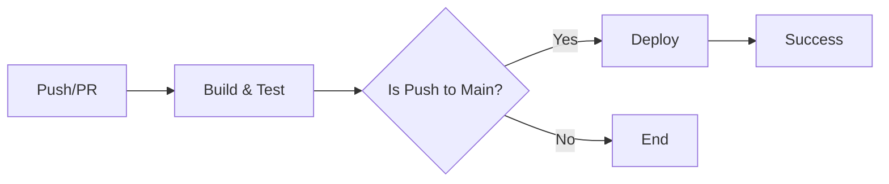

# 🚀 Guia de Deploy

## Deploy Local

### Pré-requisitos
```bash
# Configurar variáveis de ambiente
export HOSTINGER_SSH_HOST="seu_host.hostinger.com"
export HOSTINGER_SSH_USER="u123456789"
export HOSTINGER_SSH_PORT="65002"  # opcional, padrão 22
export SSH_KEY_PATH="~/.ssh/hostinger_deploy"  # opcional
```

### Executar Deploy
```bash
# Build + Deploy
npm run build
npm run deploy

# Ou em um comando
npm run build && npm run deploy
```

### Rollback
```bash
npm run rollback
```

## Deploy via GitHub Actions

O deploy automático acontece quando você faz push para `main` ou `master`:

```bash
git push origin main
```

### Secrets Necessárias no GitHub

Configure em: `Settings > Secrets and variables > Actions`

- `HOSTINGER_SSH_HOST` - Host do servidor (ex: srv123.hostinger.com)
- `HOSTINGER_SSH_USER` - Usuário SSH (ex: u123456789)
- `HOSTINGER_SSH_PORT` - Porta SSH (ex: 65002)
- `HOSTINGER_SSH_KEY` - Chave privada SSH (conteúdo completo)
- `HOSTINGER_KNOWN_HOSTS` - Fingerprint do servidor (opcional, recomendado)

### Gerar/Obter Known Hosts
```bash
ssh-keyscan -p 65002 seu_host.hostinger.com > hostinger_known_hosts
# Use o conteúdo para a secret HOSTINGER_KNOWN_HOSTS
```

## Estratégia de Deploy

O deploy usa **releases versionadas** com rollback automático:

1. **Upload** - Nova release é enviada para `~/releases/TIMESTAMP/`
2. **Backup** - Versão atual é movida para `~/public_html.bak.TIMESTAMP`
3. **Ativação** - Nova release é movida para `~/public_html`
4. **Limpeza** - Mantém apenas últimas 5 releases

### Estrutura no Servidor
```
~/
├── public_html/          # Site ativo
├── public_html.bak.*/    # Backups automáticos
└── releases/             # Releases antigas
```

## Troubleshooting

### Erro de Permissão SSH
```bash
chmod 600 ~/.ssh/hostinger_deploy
```

### Testar Conexão SSH
```bash
ssh -i ~/.ssh/hostinger_deploy -p 65002 user@host
```

### Ver Logs do Deploy
No GitHub: `Actions > CI/CD - Build & Deploy > latest run`

## CI/CD Pipeline



- **Pull Requests**: Apenas build e testes
- **Push para main**: Build, testes e deploy automático
